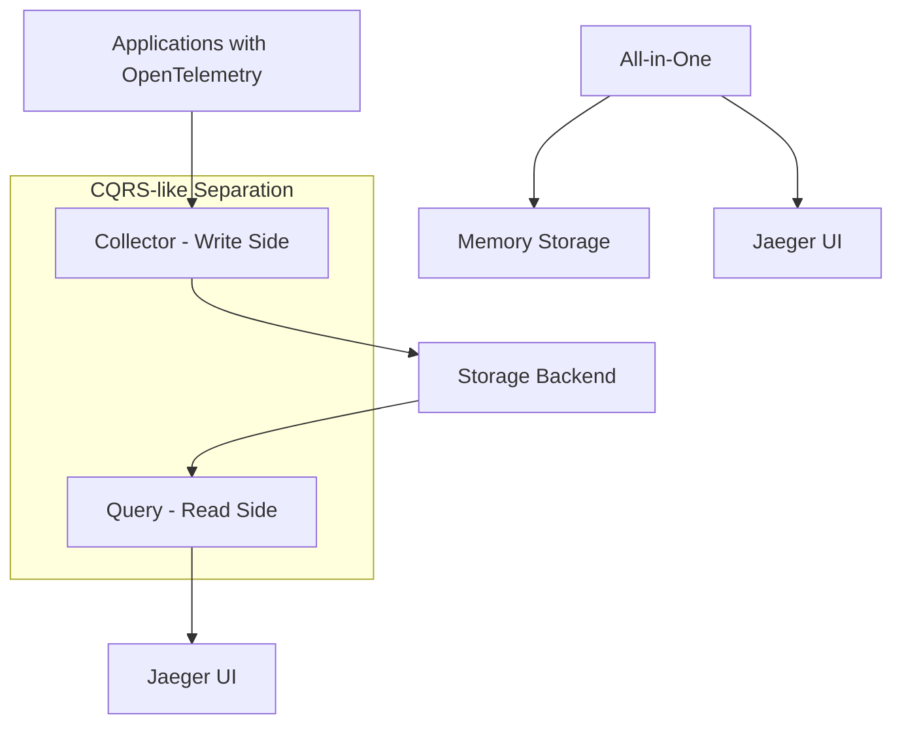

# Jaeger CQRS 아키텍처 가이드

> **작성일**: 2026-01-04 | **버전**: Jaeger 2.6.0, Elasticsearch 8.x | **난이도**: 고급

---

## 목차

- [개요](#개요)
- [결론 먼저: CQRS 패턴인가?](#-결론-먼저-cqrs-패턴인가)
- [Jaeger 2.6.0 아키텍처 분석](#jaeger-260-아키텍처-분석)
- [CQRS 관점에서의 Jaeger 아키텍처](#cqrs-관점에서의-jaeger-아키텍처)
- [Elasticsearch 통합 아키텍처](#elasticsearch-통합-아키텍처)
- [스케일링 전략](#스케일링-전략)
- [성능 최적화 가이드](#성능-최적화-가이드)
- [모니터링 및 관찰성](#모니터링-및-관찰성)
- [운영 고려사항](#운영-고려사항)
- [트러블슈팅 가이드](#트러블슈팅-가이드)
- [결론 및 권장사항](#결론-및-권장사항)
- [참고 문헌](#참고-문헌)

---

## 개요

이 문서는 Jaeger 2.6.0의 collector와 query 분리 아키텍처를 CQRS(Command Query Responsibility Segregation) 관점에서 분석하고, Elasticsearch 스토리지 백엔드와의 통합에 대해 설명합니다. 공식 문서를 기반으로 검증된 정보만을 제공합니다.

## 🔍 결론 먼저: CQRS 패턴인가?

**✅ 실질적으로는 CQRS와 유사한 패턴**을 구현하고 있지만, **❌ 공식적으로는 CQRS라고 명명하지 않음**

Jaeger 공식 문서는 **"read and write traffic 분리"** 및 **"독립적 스케일링"**이라는 용어를 사용하며, 이는 CQRS의 핵심 개념과 일치합니다.

## Jaeger 2.6.0 아키텍처 분석

### 1. 컴포넌트 분리 구조

Jaeger 2.6.0은 유연한 역할 기반 아키텍처를 제공합니다:



#### 주요 역할 (Roles)

1. **collector**: 애플리케이션으로부터 trace 데이터를 수신하고 스토리지에 **쓰기** (Command Side)
2. **query**: API와 UI를 통해 trace를 **조회**하고 시각화 (Query Side)
3. **all-in-one**: collector와 query가 단일 프로세스에서 실행 (개발/테스트용)
4. **ingester**: Kafka 버퍼링 시나리오에서 사용하는 추가 역할

### 2. 공식 문서의 분리에 대한 언급

> "**the collector/query configuration allows to separate the read and write traffic and to scale them independently**"
> 
> *- Jaeger v2 Architecture Documentation*

이는 CQRS의 핵심 원칙과 정확히 일치합니다:
- **Command(Write) 최적화**: collector가 고속 데이터 수집에 특화
- **Query(Read) 최적화**: query 서비스가 복잡한 검색과 분석에 특화

## CQRS 관점에서의 Jaeger 아키텍처

### 전통적 CQRS 패턴
```
Command Side → Write Model → Write Database
                      ↓
            Event Synchronization
                      ↓
Query Side  → Read Model ← Read Database
```

### Jaeger의 CQRS-like 패턴
```
Jaeger Collector → Write Optimized → Elasticsearch
(Command Side)       Processing         (Storage)
                                          ↓
Jaeger Query    ← Read Optimized   ← Elasticsearch
(Query Side)       Processing         (Storage)
```

### 3. 실질적 CQRS 구현 요소

#### ✅ CQRS를 지원하는 요소들

1. **물리적 분리**: collector와 query가 독립적인 프로세스로 실행 가능
2. **독립적 스케일링**: 각 컴포넌트를 필요에 따라 개별적으로 확장
3. **최적화된 처리**: 
   - collector: 대량 데이터 수집과 빠른 쓰기에 특화
   - query: 복잡한 검색과 분석에 특화
4. **트래픽 분리**: read/write 트래픽을 완전히 분리 가능

#### ❌ 전통적 CQRS와의 차이점

1. **단일 스토리지**: 별도의 read/write 데이터베이스 없이 Elasticsearch 단일 백엔드 사용
2. **이벤트 소싱 없음**: 명시적인 이벤트 스토어나 이벤트 소싱 패턴 미적용
3. **비동기 동기화 없음**: read/write 모델 간 별도 동기화 메커니즘 없음

## Elasticsearch 통합 아키텍처

### 1. Elasticsearch의 역할

```yaml
# Jaeger 2.6.0 Elasticsearch 설정 예시
jaeger:
  storage:
    type: elasticsearch
    elasticsearch:
      server-urls: http://elasticsearch:9200
      index-prefix: jaeger
      use-ilm: true  # Index Lifecycle Management
```

#### Write Path (Collector → Elasticsearch)
```
Applications → OpenTelemetry → Jaeger Collector → Elasticsearch
                                      ↓
                          [Jaeger Storage Exporter]
                                      ↓
                            Elasticsearch Indices:
                            - jaeger-span-{date}
                            - jaeger-service-{date}
                            - jaeger-dependencies-{date}
```

#### Read Path (Query ← Elasticsearch)
```
Jaeger UI ← Jaeger Query ← [Jaeger Query Extension] ← Elasticsearch
```

### 2. Elasticsearch vs Cassandra 비교

| 측면 | Elasticsearch | Cassandra |
|------|---------------|-----------|
| **검색 능력** | 🔥 **강력한 전문 검색** | 🔍 기본적인 K-V 검색 |
| **쓰기 성능** | ⚡ 빠름 | ⚡⚡ 매우 빠름 |
| **확장성** | 📈 수평 확장 | 📈📈 뛰어난 수평 확장 |
| **운영 복잡도** | 🔧 보통 | 🔧🔧 높음 |
| **CQRS 적합성** | ✅ **쿼리 최적화 우수** | ✅ 커맨드 최적화 우수 |

공식 문서에 따르면:
> "Elasticsearch does not suffer from these issues [search limitations], resulting in **better usability**"

### 3. 실제 배포 패턴

#### 패턴 1: Direct-to-Storage (간단한 CQRS)
```
Applications → Collector → Elasticsearch ← Query ← UI
```

#### 패턴 2: Kafka-Buffered (고급 CQRS + Event Streaming)
```
Applications → Collector → Kafka → Ingester → Elasticsearch ← Query ← UI
```

## 스케일링 전략

### 1. CQRS 관점의 독립적 스케일링

```yaml
# Collector (Write Side) 스케일링
collector_replicas: 5  # 높은 데이터 수집 트래픽 대응
collector_resources:
  memory: "1Gi"
  cpu: "500m"

# Query (Read Side) 스케일링  
query_replicas: 3      # UI 사용자와 API 호출 대응
query_resources:
  memory: "2Gi"        # 복잡한 검색을 위한 메모리 증대
  cpu: "1000m"
```

### 2. Elasticsearch 샤딩 전략

```json
{
  "jaeger-span-template": {
    "settings": {
      "number_of_shards": 5,     // Write 성능 최적화
      "number_of_replicas": 1,   // Read 성능 최적화
      "refresh_interval": "5s"   // Near real-time 검색
    }
  }
}
```

## 성능 최적화 가이드

### 1. Write Side (Collector) 최적화

```yaml
# collector 설정 최적화
processors:
  batch:
    send_batch_size: 1024      # 배치 크기 증가
    timeout: 5s
    send_batch_max_size: 2048

  memory_limiter:
    limit_mib: 1024            # 메모리 제한
```

### 2. Read Side (Query) 최적화

```yaml
# query 설정 최적화  
query:
  max_traces: 1500             # 결과 제한
  default_max_traces: 100
  
  elasticsearch:
    max_scroll_size: 10000     # 스크롤 크기 최적화
    max_num_spans: 50000       # 최대 span 수 제한
```

### 3. Elasticsearch Index Template 최적화

```json
{
  "mappings": {
    "properties": {
      "traceID": {
        "type": "keyword",       // 정확한 매칭을 위한 keyword
        "index": true
      },
      "spanID": {
        "type": "keyword"
      },
      "operationName": {
        "type": "text",          // 검색을 위한 text 타입
        "analyzer": "standard"
      },
      "startTime": {
        "type": "date",          // 시간 기반 쿼리 최적화
        "format": "epoch_micros"
      }
    }
  }
}
```

## 모니터링 및 관찰성

### 1. CQRS 성능 지표

#### Write Side 모니터링
```yaml
metrics:
  - jaeger_collector_spans_received_total
  - jaeger_collector_batch_size_bucket
  - elasticsearch_write_latency
  - elasticsearch_indexing_rate
```

#### Read Side 모니터링
```yaml  
metrics:
  - jaeger_query_requests_total
  - jaeger_query_request_duration
  - elasticsearch_search_latency
  - elasticsearch_query_rate
```

### 2. Elasticsearch 클러스터 상태
```bash
# 클러스터 건강 상태
curl http://elasticsearch:9200/_cluster/health

# 인덱스 상태 확인
curl http://elasticsearch:9200/_cat/indices/jaeger*
```

## 운영 고려사항

### 1. 데이터 보관 정책 (ILM)

```json
{
  "policy": {
    "phases": {
      "hot": {
        "min_age": "0ms",
        "actions": {
          "rollover": {
            "max_age": "1d",
            "max_size": "50GB"
          }
        }
      },
      "warm": {
        "min_age": "1d",
        "actions": {
          "allocate": {
            "number_of_replicas": 0
          }
        }
      },
      "delete": {
        "min_age": "30d"          # 30일 후 삭제
      }
    }
  }
}
```

### 2. 백업 전략

```bash
# Elasticsearch 스냅샷 설정
PUT /_snapshot/jaeger_backup
{
  "type": "fs",
  "settings": {
    "location": "/backup/jaeger"
  }
}
```

### 3. 보안 고려사항

```yaml
# Elasticsearch 보안 설정
xpack.security.enabled: true
xpack.security.transport.ssl.enabled: true

# Jaeger 인증
jaeger:
  query:
    bearer_token_propagation: true
```

## 트러블슈팅 가이드

### 1. Write 성능 이슈

**증상**: collector에서 데이터 손실 또는 지연
**해결책**:
```yaml
# 배치 크기 조정
processors:
  batch:
    send_batch_size: 512    # 줄여서 지연 감소
    timeout: 2s

# Elasticsearch 리프레시 간격 증가
PUT /jaeger*/_settings
{
  "refresh_interval": "30s"  # 기본 1s에서 증가
}
```

### 2. Read 성능 이슈

**증상**: UI에서 검색이 느림
**해결책**:
```yaml
# 쿼리 제한 설정
query:
  max_traces: 500           # 결과 수 제한
  
# Elasticsearch 캐시 활성화
PUT /jaeger*/_settings
{
  "index.requests.cache.enable": true
}
```

### 3. 스토리지 용량 관리

```bash
# 오래된 인덱스 정리
curl -X DELETE "elasticsearch:9200/jaeger-span-2024.01*"

# ILM 정책 적용 확인
GET /jaeger*/_ilm/explain
```

## 결론 및 권장사항

### Jaeger는 실질적 CQRS 패턴 구현체

1. **✅ 장점**:
   - Write/Read 트래픽의 물리적 분리
   - 독립적 스케일링 가능
   - 각 역할에 최적화된 성능
   - Elasticsearch의 강력한 검색 능력 활용

2. **⚠️ 제약사항**:
   - 전통적 CQRS보다 단순한 형태
   - 단일 스토리지 백엔드 의존성
   - 복잡한 이벤트 소싱 패턴 미지원

### 권장 배포 전략

#### 소규모 환경 (≤ 1000 traces/sec)
```yaml
deployment: all-in-one
storage: memory  # 또는 간단한 Elasticsearch
```

#### 중규모 환경 (1000-10000 traces/sec)
```yaml
deployment: collector + query (분리)
storage: Elasticsearch (단일 클러스터)
scaling: collector=2, query=1
```

#### 대규모 환경 (≥ 10000 traces/sec)
```yaml
deployment: collector + query + ingester
storage: Elasticsearch (다중 노드 클러스터)
buffering: Kafka
scaling: collector=5+, query=3+, ingester=2+
```

### 최종 결론

**Jaeger 2.6.0의 collector/query 분리는 명시적으로 CQRS라고 명명되지는 않았지만, CQRS의 핵심 원칙인 "command와 query의 책임 분리"를 실질적으로 구현하고 있습니다.** 

특히 Elasticsearch와 결합했을 때, 뛰어난 write 성능과 강력한 검색 능력을 동시에 제공하여 분산 추적 시스템에 최적화된 CQRS 아키텍처를 구현합니다.

## 참고 문헌

- [Jaeger v2 Architecture Documentation](https://www.jaegertracing.io/docs/next-release-v2/architecture/)
- [Jaeger 2.6.0 Getting Started](https://www.jaegertracing.io/docs/2.6/getting-started/)
- [Elasticsearch Storage Backend](https://www.jaegertracing.io/docs/2.10/storage/elasticsearch/)
- [CNCF Jaeger GitHub Repository](https://github.com/jaegertracing/jaeger)